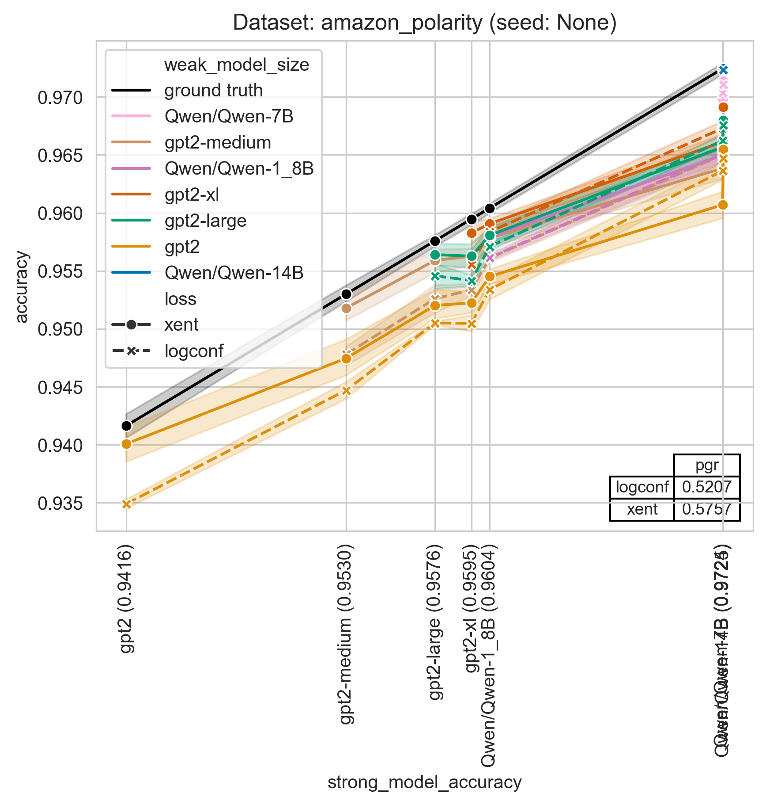
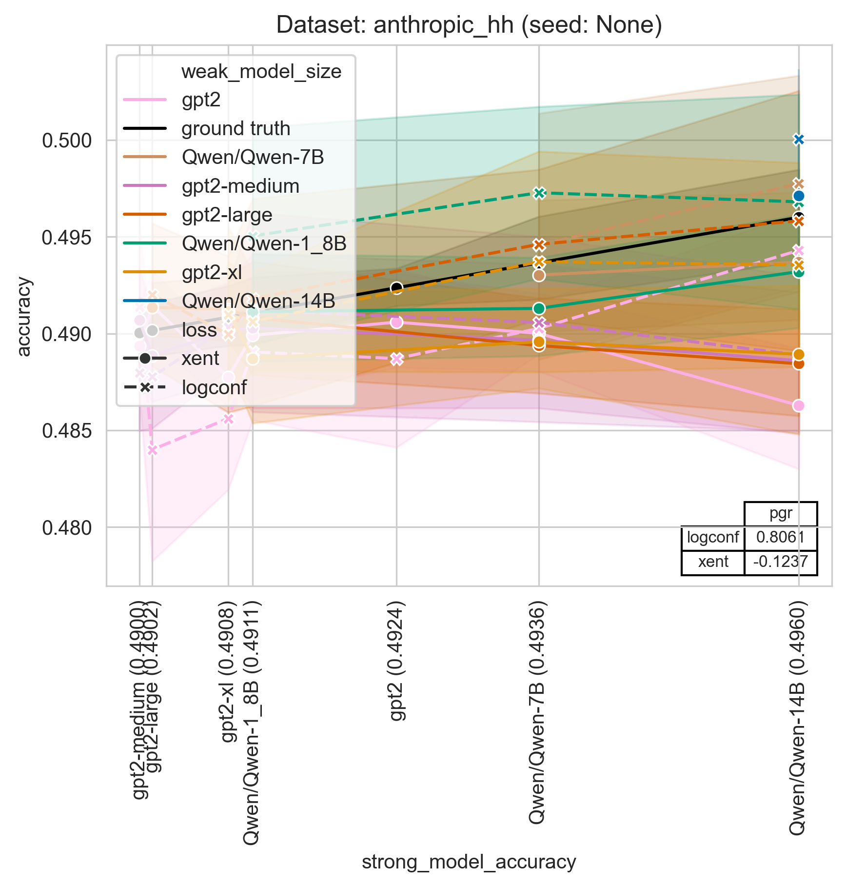
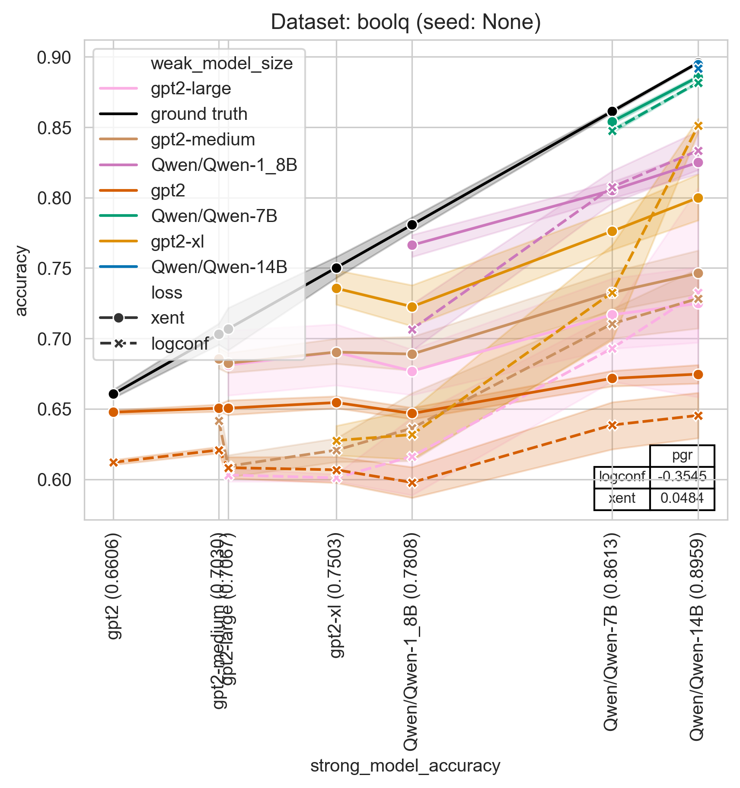
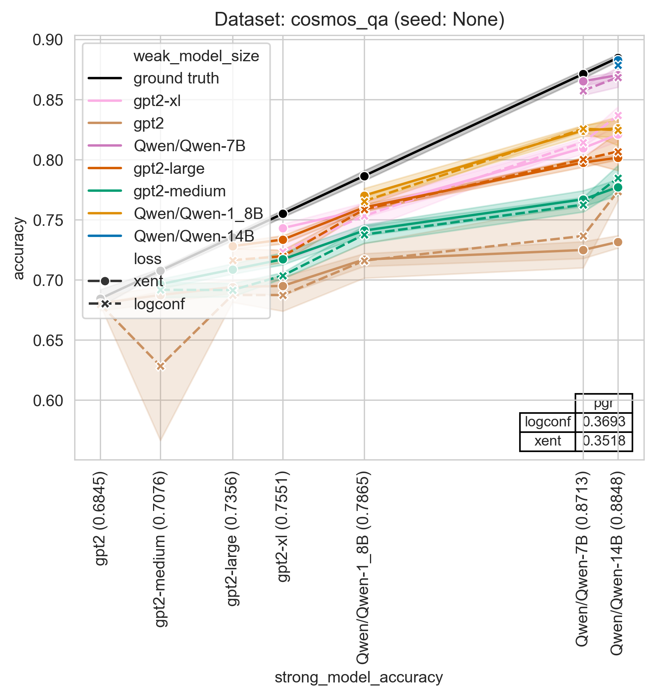
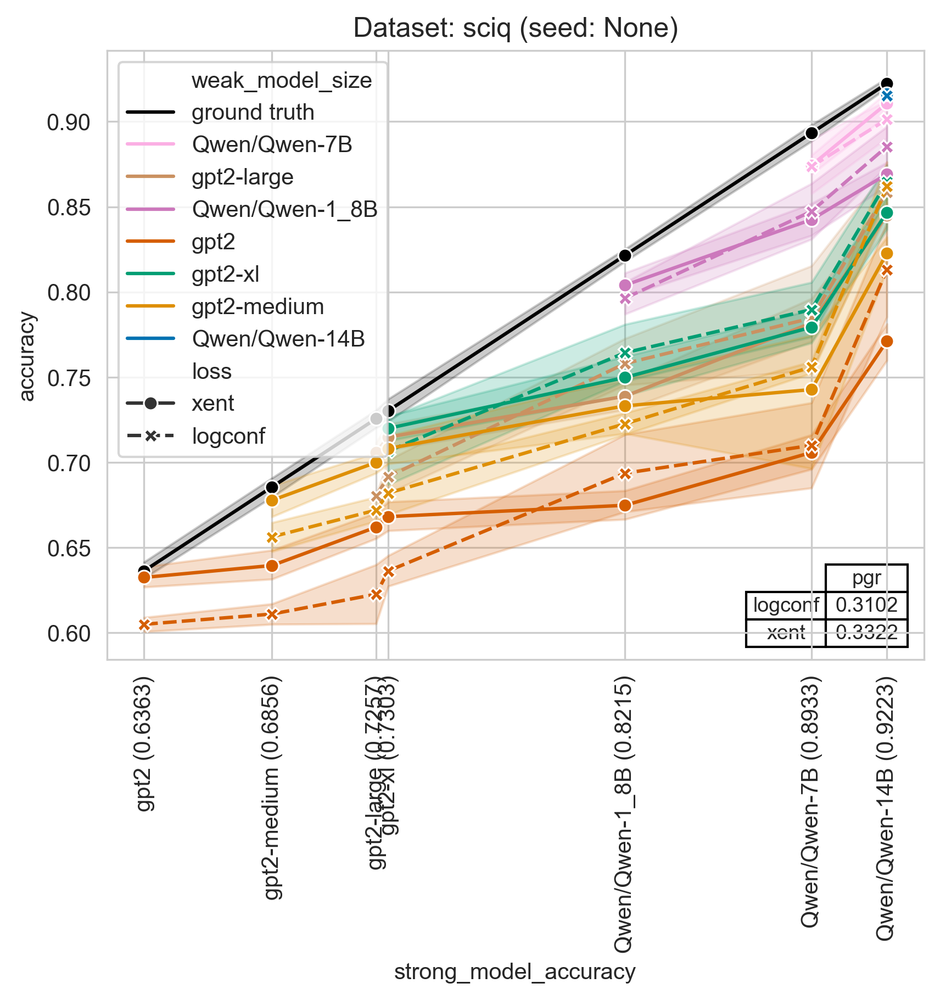

**STATUS**: This codebase is not well tested and does not use the exact same settings we used in the paper, but in our experience gives qualitatively similar results when using large model size gaps and multiple seeds.  Expected results can be found for two datasets below.

# Weak-to-strong generalization


This project contains code for implementing our [paper on weak-to-strong generalization](https://cdn.openai.com/papers/weak-to-strong-generalization.pdf).

The primary codebase contains a re-implementation of our weak-to-strong learning setup for binary classification tasks.  The codebase contains code for fine-tuning pretrained language models, and also training against the labels from another language model.  We support various losses described in the paper as well, such as the confidence auxiliary loss.

The `vision` directory contains stand-alone code for weak-to-strong in the vision models setting (AlexNet -> DINO on ImageNet).

### Getting Started

These instructions will get you a copy of the project up and running on your local machine for development and testing purposes.

#### Installation

You need to have Python installed on your machine. The project uses `pyproject.toml` to manage dependencies. To install the dependencies, you can use a package manager like `pip`:

```
pip install .
```

#### Running the Script

The main script of the project is `sweep.py`. It can be run from the command line using the following command:
```
python sweep.py --model_sizes=gpt2,gpt2-medium
```

In addition to `--model_sizes`, `sweep.py` takes in almost all of the arguments that `train_simple.py` takes (e.g.
`--batch_size`, `--n_docs`, `--n_test_docs` etc., see `train_simple.py` for a full list). These arguments are simply
forwarded to `train_simple.py`.

`sweep.py` calls `train_simple.py` in the following way:
1. First, it calls `train_simple.py` for each model size to train the ground truth models
2. Then, for each pair of weak and strong models in `model_sizes` (where a model can be the strong model in the pair
   only if its index in the `model_sizes` list is >= the index of the weak model), it calls `train_simple.py` with a
   `--weak_model_size` argument so that the strong model is trained with the labels of the weak model.

E.g. the example above will run gpt2 (ground truth), gpt2-medium (ground truth), gpt2 -> gpt2, gpt2 -> gpt2-medium, and
gpt2-medium -> gpt2-medium.

If needed, you can also run `train_simple.py` directly.

Note that `sweep.py` will not accept the arguments `--weak_model_size`, `--weak_labels_path` or `--model_size` (as opposed
to `--model_sizes`, with an "s") as choosing their values automatically is precisely the point of `sweep.py`.

An example of Jupyter notebook for plotting results is found in `notebooks/Plotting.ipynb`.

At the time of release, the main script was called `train_weak_to_strong.py`, but it was less usable than
`sweep.py` and `train_simple.py`. It is preserved here and the old instructions are given at the end of the document.

#### Expected results


<br>

<br>

<br>

<br>


### Authors

- Adrien Ecoffet
- Manas Joglekar
- Jeffrey Wu
- Jan Hendrik Kirchner
- Pavel Izmailov (vision)

### License

This project is licensed under the MIT License - see the LICENSE.md file for details.

### Acknowledgments

- Hugging Face for their open-source transformer models

### Original single run script

You can run the original training script using:
```
python train_weak_to_strong.py
```

The script accepts several command-line arguments to customize the training process. Here are some examples:

```
python train_weak_to_strong.py --batch_size 32 --max_ctx 512 --ds_name "sciq" --loss "logconf" --n_docs 1000 --n_test_docs 100 --weak_model_size "gpt2-medium" --strong_model_size "gpt2-large" --seed 42
```

The notebook `notebooks/Plotting_old.ipynb` preserves the plotting notebook corresponding to old style training.

The key difference between this style and the new `sweep.py` style is that `train_weak_to_strong.py` will always
train three models: a weak model, a transfer model, and a strong model. `sweep.py` optimizes this by training
a series of ground truth models (which will serve as weak and strong models) as well as a series of transfer models
all in one go. This reduces training duplication and is arguably simpler. The files generated by `train_simple.py`
and `sweep.py` are also simpler to use. 