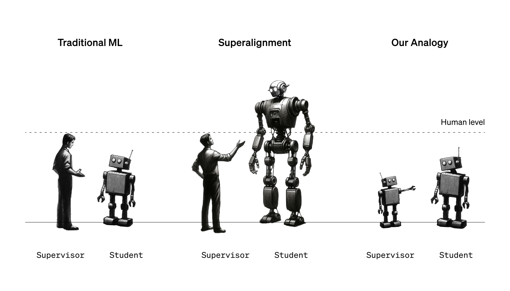
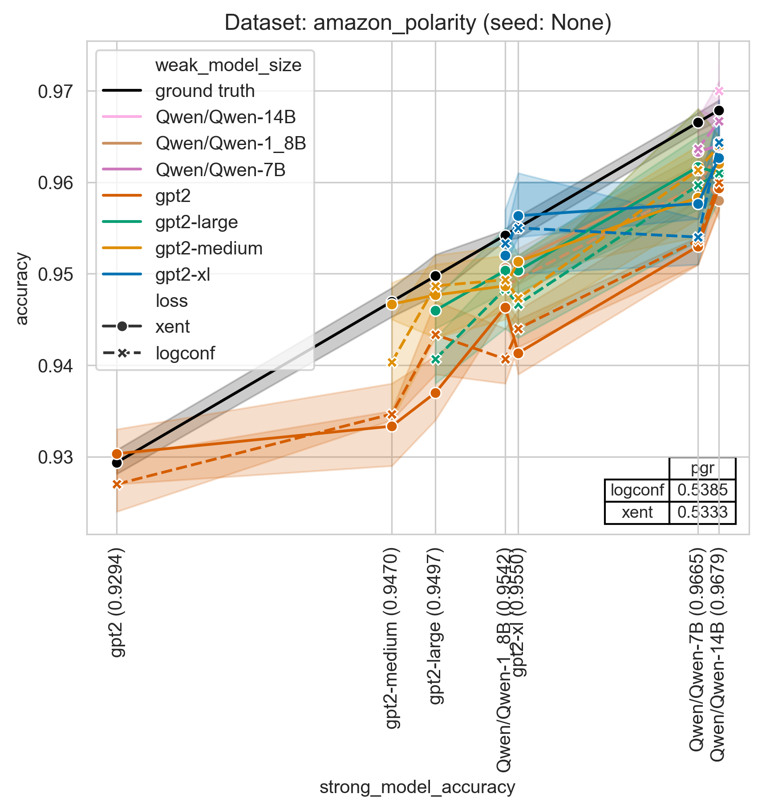
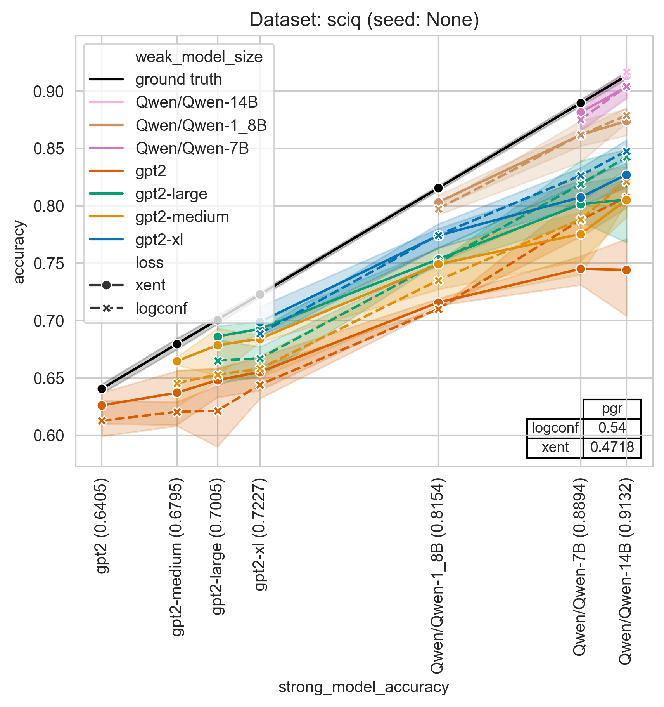
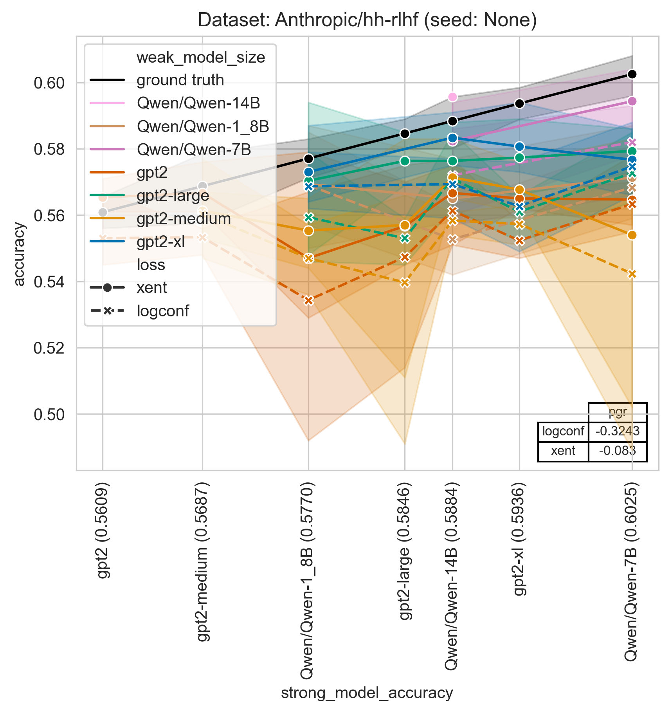

**STATUS**: This codebase is not well tested and does not use the exact same settings we used in the paper, but in our experience gives qualitatively similar results when using large model size gaps and multiple seeds.  Expected results can be found for two datasets below.  We may update the code significantly in the coming week.

# Weak-to-strong generalization



This project contains code for implementing our [paper on weak-to-strong generalization](https://cdn.openai.com/papers/weak-to-strong-generalization.pdf).

The primary codebase contains a re-implementation of our weak-to-strong learning setup for binary classification tasks.  The codebase contains code for fine-tuning pretrained language models, and also training against the labels from another language model.  We support various losses described in the paper as well, such as the confidence auxiliary loss.

The `vision` directory contains stand-alone code for weak-to-strong in the vision models setting (AlexNet -> DINO on ImageNet).

### Getting Started

These instructions will get you a copy of the project up and running on your local machine for development and testing purposes.

#### Installation

You need to have Python installed on your machine. The project uses `pyproject.toml` to manage dependencies. To install the dependencies, you can use a package manager like `pip`:

```
pip install .
```

#### Running the Script

The main script of the project is train_weak_to_strong.py. It can be run from the command line using the following command:
```
python train_weak_to_strong.py
```

The script accepts several command-line arguments to customize the training process. Here are some examples:

```
python train_weak_to_strong.py --batch_size 32 --max_ctx 512 --ds_name "sciq" --loss "logconf" --n_docs 1000 --n_test_docs 100 --weak_model_size "gpt2-medium" --strong_model_size "gpt2-large" --seed 42
```

#### Expected results


<br>

<br>


### Authors

- Adrien Ecoffet
- Manas Joglekar
- Jeffrey Wu
- Jan Hendrik Kirchner
- Pavel Izmailov (vision)

### License

This project is licensed under the MIT License - see the LICENSE.md file for details.

### Acknowledgments

- Hugging Face for their open-source transformer models
